# 📱 Tyrano Player for Android

**Tyrano Player for Android** is a dedicated mobile visual novel launcher and player built from the ground up for Android devices. Play TyranoScript games offline with complete control over your library, save files, community translations, and patch mods.

---

## ✨ Features at a Glance

### 🎮 Game Library & Recent Sessions
Browse your visual novel collection in a responsive grid, filter by genre or favorites, and jump right back in with one tap.

  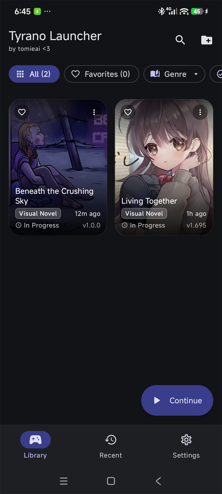
  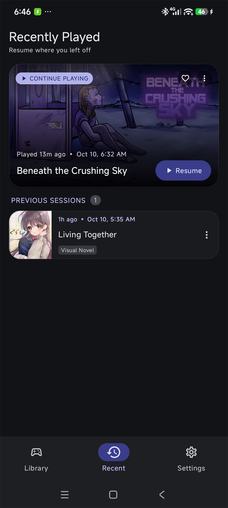
  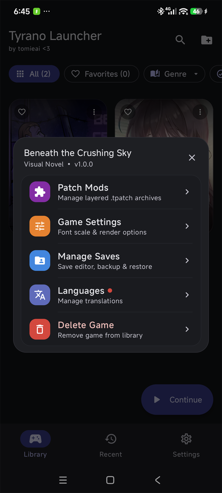

- **Cover Grid & Filters**: Browse titles with status tags, custom covers, and genre chips.
- **Quick Resume**: Jump back into your active game directly from the home or recent screen.
- **Game Management**: Quick-access options for mods, saves, settings, and translations.

---

### 💾 Save Manager & Live Save Editor
Safely backup your progress, transfer saves, or customize game variables directly on your phone.

  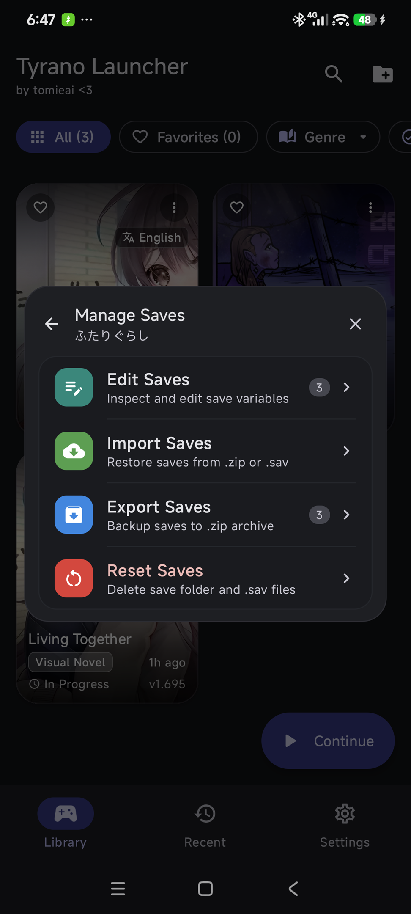
  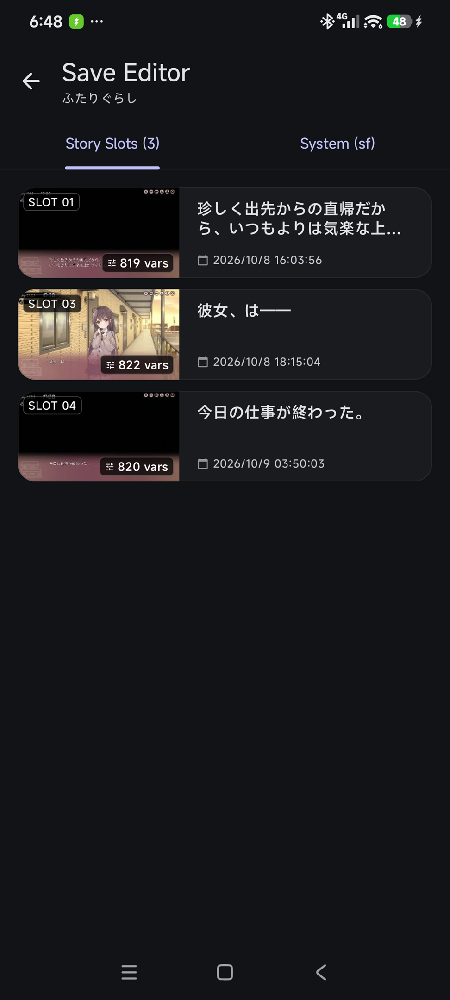
  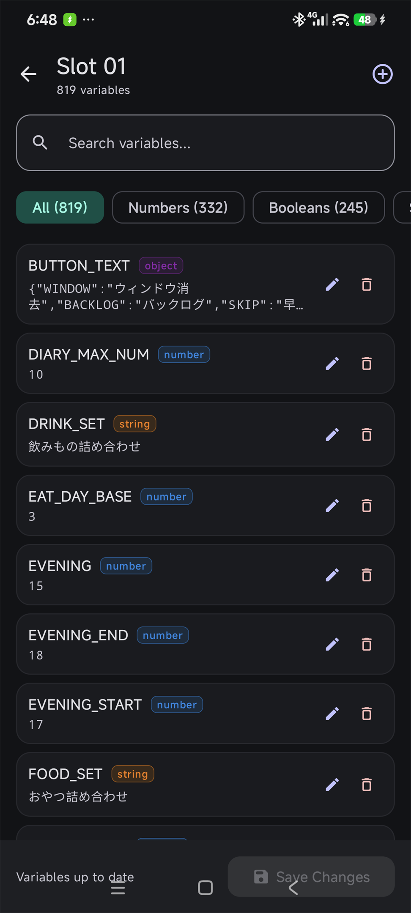

- **Visual Slot Browser**: See slot thumbnails, timestamps, story dialogue previews, and variable counts.
- **Save Variable Editor**: Search and edit variables with filters for numbers, booleans, and text.
- **Import & Export**: Backup saves to `.zip` archives or import existing save files effortlessly.

---

### 🌐 Live Translation & Translation Editor
Play games in your preferred language or translate your favorite stories on the go.

  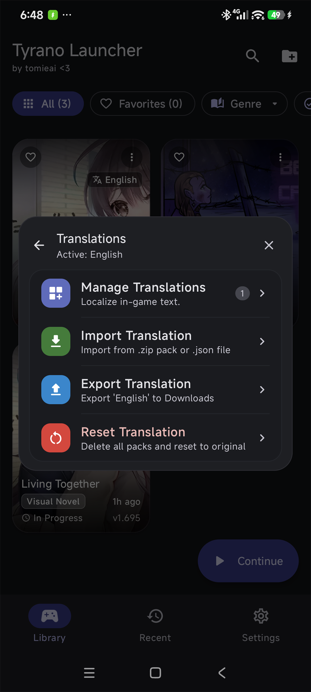
  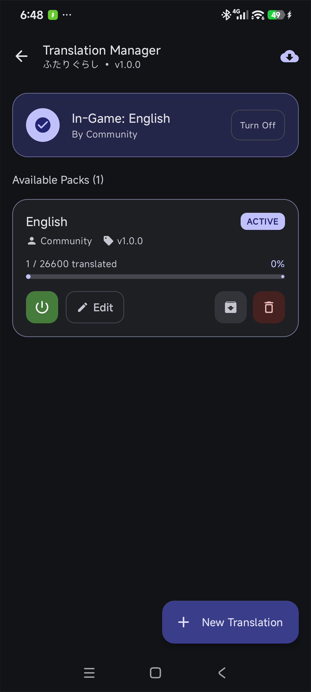
  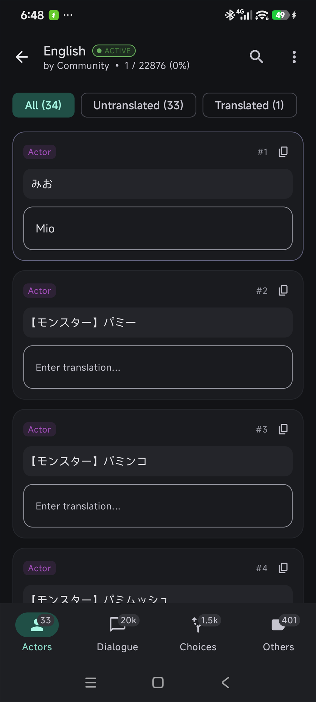

- **Language Packs**: Switch translation packs on or off without altering original game files.
- **Pack Manager**: Track translation progress and import community packs with ease.
- **Built-in Editor**: Edit character names, dialogue, choices, and UI text with instant in-game updates.

---

### 🧩 Patch Mods & Game Customization
Enhance your games with layered patch mods and tailored display preferences.

  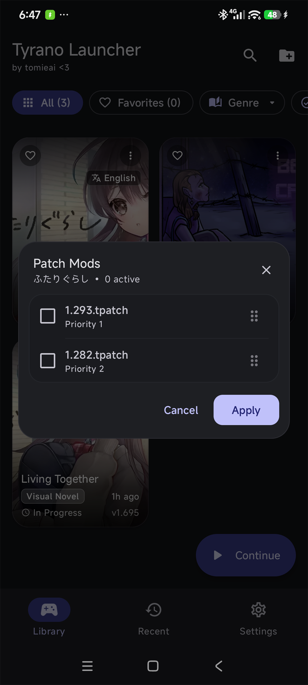
  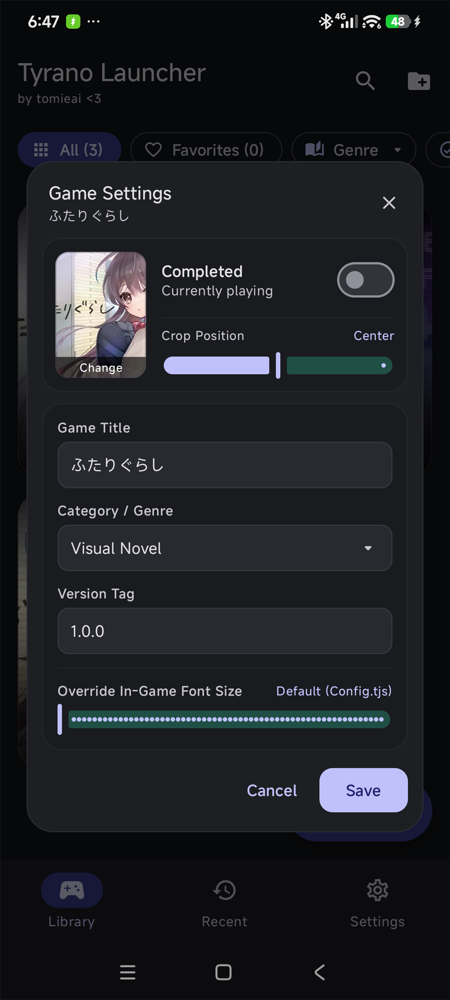
  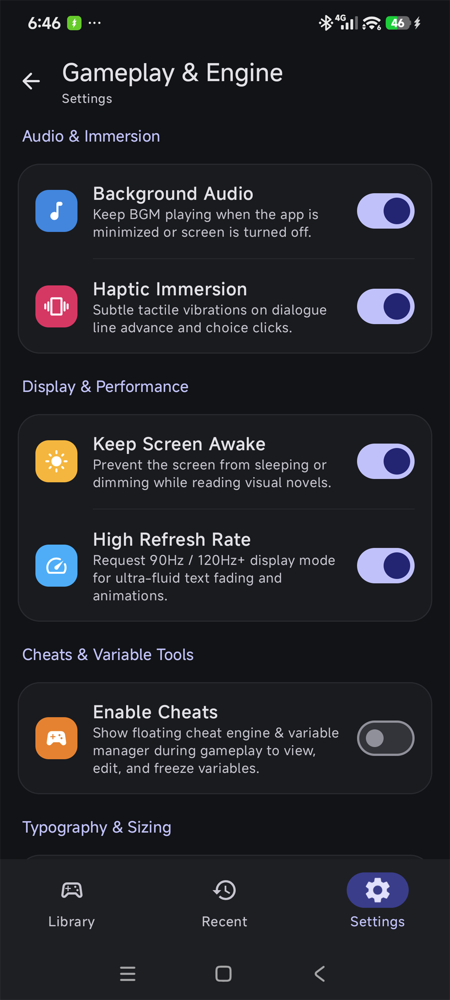

- **Priority Patch Mods**: Layer and order mod patches with simple drag-and-drop priority sorting.
- **Custom Game Settings**: Set custom covers, adjust banner cropping, and override font sizes per game.
- **Audio & Display Immersion**: Enjoy background audio playback, tactile haptics, high refresh rate support (90Hz / 120Hz+), and keep-screen-awake mode.

